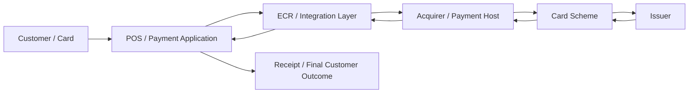
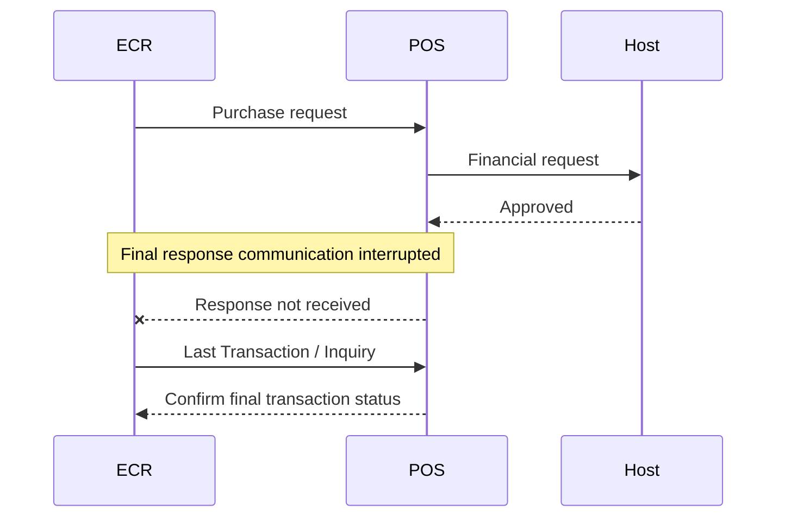
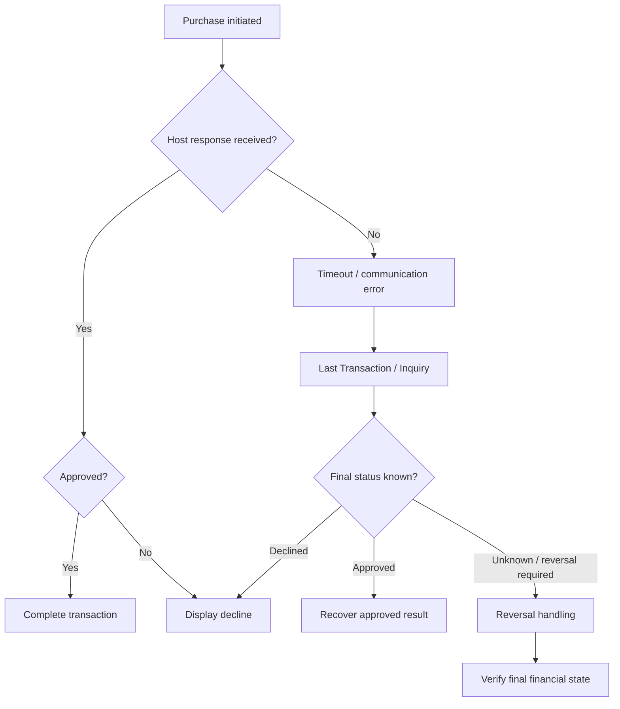

# 💳 Payment Testing Case Study


A practical **manual payment-testing portfolio project** covering POS transaction flows, ECR integration, ISO 8583 validation, EMV checks, refunds, voids, reversals, fallback, settlement and real-world-style incident investigation.

This repository is intentionally focused on **manual testing, payment-domain analysis and defect investigation**, reflecting hands-on QA work across payment applications and POS integrations.

> **Privacy note:** All examples are synthetic and generic. No real bank, merchant, terminal, cardholder, production log, credential, key or confidential client information is included.

---

## 🚀 What this project demonstrates

- Manual functional, regression and UAT testing
- POS and ECR transaction validation
- Purchase, void, refund and reversal scenarios
- Contact, contactless and swipe/fallback testing
- PIN/CVM and cardholder-verification scenarios
- ISO 8583 request/response validation
- EMV transaction-flow understanding
- Settlement and reconciliation checks
- Negative testing and decline validation
- Defect reporting and root-cause-oriented investigation
- API and SQL validation
- Production-support style troubleshooting

---

## 🔄 End-to-end payment flow



As a tester, validation is not limited to whether the receipt says **Approved** or **Declined**. I also verify the request, response, transaction identifiers, card interface, terminal behaviour, host result, database record and final customer-facing outcome.

---

## 🔎 Payment Failure Investigation Lab

### Scenario — Host approved, but POS/ECR shows failed

A transaction can reach the host successfully while the final response is lost because of a communication interruption.



**QA focus:**

- Confirm the host-side outcome before allowing a retry.
- Match STAN/RRN/reference values where available.
- Validate Last Transaction / inquiry handling.
- Check whether a reversal is required.
- Verify duplicate prevention.
- Confirm database/TMS and settlement status.

👉 **[View 5 synthetic transaction investigation case studies](docs/transaction-investigation-case-studies.md)**

---

## 🧪 Core test scenarios

| Area | Example checks |
|---|---|
| **Purchase** | Approved sale, issuer decline, timeout, duplicate prevention |
| **Contact** | Application selection, PIN/CVM, online result, card removal |
| **Contactless** | Tap flow, CVM limit behaviour, interface switching |
| **Fallback** | Chip failure followed by permitted swipe flow |
| **Void** | Same-batch cancellation, reference matching, status update |
| **Refund** | Valid refund, invalid reference, partial/full amount rules |
| **Reversal** | Communication loss after host processing, duplicate protection |
| **Settlement** | Batch totals, no-batch condition, host acknowledgement |
| **ECR** | Request/response mapping, timeout, retry/Last Transaction handling |
| **Negative** | Invalid amount, cancel, network loss, host decline, terminal errors |

---

## 🧾 ISO 8583 validation example

A payment tester should understand how the terminal-facing result relates to the financial message exchanged with the host.

| Data element | Typical QA validation |
|---|---|
| **MTI** | Correct request/response message type for the implementation |
| **DE3** | Processing code matches transaction type |
| **DE4** | Transaction amount is correctly formatted |
| **DE11** | STAN is populated and can be correlated |
| **DE37** | Retrieval Reference Number is correctly handled |
| **DE39** | Host response code maps to the correct terminal result |
| **DE41** | Terminal identifier is correct |
| **DE55** | EMV data is present/valid where applicable |

> Exact MTIs and data-element usage vary by host and implementation.

---

## 💳 EMV checks I look at

For chip/contactless investigations, useful evidence may include:

- `9F26` — Application Cryptogram
- `9F27` — Cryptogram Information Data
- `9F34` — CVM Results
- `9F36` — Application Transaction Counter
- `95` — Terminal Verification Results
- Card interface and application-selection result
- Online/offline decision path
- Fallback/interface-switching behaviour

The goal is not only to read tags, but to connect the **card decision + terminal decision + host result + customer outcome**.

---

## ♻️ Transaction recovery lifecycle



---

## 🧭 How I approach a payment issue

1. Reproduce the scenario with controlled test data.
2. Capture transaction time, amount, interface and reference details.
3. Check terminal/ECR behaviour and the visible error.
4. Compare request and response messages.
5. Validate important ISO 8583 fields when available.
6. Review EMV result/cryptogram information for chip or contactless cases.
7. Confirm whether the host approved, declined or never responded.
8. Check whether a reversal, retry or Last Transaction flow was generated.
9. Validate database/TMS records and settlement impact.
10. Raise a defect with clear evidence, expected result and actual result.

---

## 📂 Repository contents

```text
payment-testing-case-study/
├── docs/
│   ├── manual-test-cases.md
│   ├── iso8583-validation.md
│   ├── emv-flow.md
│   ├── defect-examples.md
│   ├── transaction-investigation-case-studies.md
│   └── uat-checklist.md
├── test-cases/
│   └── payment-test-cases.csv
└── README.md
```

### Quick links

- 📋 [Manual Payment Test Cases](docs/manual-test-cases.md)
- 🧾 [ISO 8583 Validation](docs/iso8583-validation.md)
- 💳 [EMV Transaction Flow](docs/emv-flow.md)
- 🐞 [Defect Examples](docs/defect-examples.md)
- 🔎 [Transaction Investigation Case Studies](docs/transaction-investigation-case-studies.md)
- ✅ [UAT Checklist](docs/uat-checklist.md)

---

## ⚠️ Important note on standards

Exact ISO 8583 MTIs, field usage, EMV parameters, fallback rules and transaction behaviour vary by acquirer, host, scheme, kernel and implementation. The examples in this repository are **illustrative QA examples**, not a specification for any particular bank or production system.

---

## 🛠 Skills represented

`Manual Testing` · `Functional Testing` · `Regression Testing` · `UAT` · `Payments QA` · `POS` · `ECR` · `ISO 8583` · `EMV` · `API Testing` · `SQL Validation` · `Defect Analysis` · `Production Support`

---

## 👤 Author

**Bijin Benni**  
Software Test Engineer | Manual QA | Payments & POS Systems | ISO 8583 | EMV | API Testing

- Portfolio: https://bijin1830.github.io
- LinkedIn: https://www.linkedin.com/in/bijinbenni
- GitHub: https://github.com/bijin1830

---

### ⭐ Found this useful?

If this repository helped you understand payment testing or gave you ideas for your own QA work, consider giving it a **Star** ⭐.
