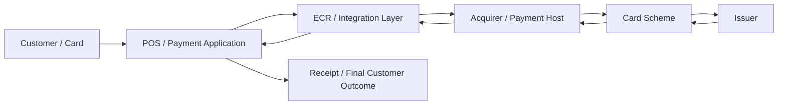

# 💳 Payment Testing Case Study


A practical **manual payment-testing portfolio project** covering POS transaction flows, ECR integration, ISO 8583 validation, EMV checks, refunds, voids, reversals, fallback, settlement, SQL validation and incident investigation.

> **Privacy note:** All examples are synthetic and generic. No real bank, merchant, terminal, cardholder, production log, credential, key or confidential client information is included.

## What this project demonstrates

- Manual functional, regression and UAT testing
- POS and ECR transaction validation
- Purchase, void, refund and reversal scenarios
- Contact, contactless and fallback testing
- PIN/CVM validation
- ISO 8583 request/response correlation
- EMV evidence review
- Settlement and reconciliation
- Negative/resilience testing
- SQL/data validation
- Requirement-to-test traceability
- Defect reporting and root-cause-oriented investigation

## End-to-end payment flow


```mermaid
flowchart LR
    A[Customer / Card] --> B[POS / Payment Application]
    B --> C[ECR / Integration Layer]
    C --> D[Acquirer / Payment Host]
    D --> E[Card Scheme]
    E --> F[Issuer]
    F --> E
    E --> D
    D --> C
    C --> B
    B --> G[Receipt / Final Customer Outcome]
```

A tester should validate more than the final receipt. I correlate the card/EMV result, POS state, ECR response, host result, database record and settlement outcome.

## Key portfolio sections

- [Manual Payment Test Cases](docs/manual-test-cases.md)
- [Transaction Investigation Case Studies](docs/transaction-investigation-case-studies.md)
- [ISO 8583 Validation](docs/iso8583-validation.md)
- [EMV Transaction Flow](docs/emv-flow.md)
- [SQL Validation for Payment QA](docs/sql-validation.md)
- [Payment QA Traceability Matrix](docs/traceability-matrix.md)
- [Sample Defect Reports](docs/defect-examples.md)
- [Payment UAT Checklist](docs/uat-checklist.md)
- [Interview Walkthrough](docs/interview-walkthrough.md)

## Core scenario coverage

| Area | Example checks |
|---|---|
| Purchase | Approval, decline, invalid amount, duplicate retry |
| Contact / Contactless | AID/application, CVM, kernel/card outcome |
| Fallback | Allowed interface transition only |
| Void | Original reference and batch rules |
| Refund | Full refund, invalid reference, over-refund |
| Reversal | Timeout recovery and duplicate reversal prevention |
| Settlement | Totals, host timeout, batch close rules |
| ECR | Mapping, timeout, malformed request, duplicate protection |
| Resilience | Cancel, restart, network interruption |
| SQL | Status, duplicates, reversal linkage, settlement totals |

## ISO 8583 validation examples

Useful fields during investigation can include:

| Data element | Typical QA use |
|---|---|
| DE3 | Processing code |
| DE4 | Amount |
| DE11 | STAN |
| DE22 | Entry mode |
| DE37 | RRN |
| DE38 | Authorization code |
| DE39 | Response code |
| DE41 | Terminal ID |
| DE42 | Merchant ID |
| DE49 | Currency |
| DE55 | EMV data |

Exact fields vary by implementation.

## EMV evidence examples

Common tags that may support investigation:

- `9F26` — Application Cryptogram
- `9F27` — Cryptogram Information Data
- `9F34` — CVM Results
- `9F36` — Application Transaction Counter
- `95` — Terminal Verification Results

The key is to connect **card decision + terminal decision + host result + customer outcome**.

## Investigation approach

1. Reproduce with controlled test data.
2. Capture timestamp, amount, interface and reference.
3. Check POS/ECR behaviour.
4. Compare request/response messages.
5. Validate ISO 8583 fields where available.
6. Review EMV evidence for card transactions.
7. Confirm host-side outcome.
8. Check reversal, retry or inquiry flow.
9. Validate database/TMS state.
10. Check settlement impact.
11. Raise a defect with evidence and business risk.

## Repository structure

```text
payment-testing-case-study/
├── docs/
│   ├── manual-test-cases.md
│   ├── iso8583-validation.md
│   ├── emv-flow.md
│   ├── defect-examples.md
│   ├── transaction-investigation-case-studies.md
│   ├── sql-validation.md
│   ├── traceability-matrix.md
│   ├── interview-walkthrough.md
│   └── uat-checklist.md
├── test-cases/
│   └── payment-test-cases.csv
└── README.md
```

## Skills represented

`Manual Testing` · `Functional Testing` · `Regression Testing` · `UAT` · `Payments QA` · `POS` · `ECR` · `ISO 8583` · `EMV` · `API Testing` · `SQL Validation` · `Traceability` · `Defect Analysis` · `Production Support`

## Author

**Bijin Benni**  
Software Test Engineer | Payments & POS Systems | ISO 8583 | EMV | API Testing

- Portfolio: https://bijin1830.github.io
- LinkedIn: https://www.linkedin.com/in/bijinbenni
- GitHub: https://github.com/bijin1830
