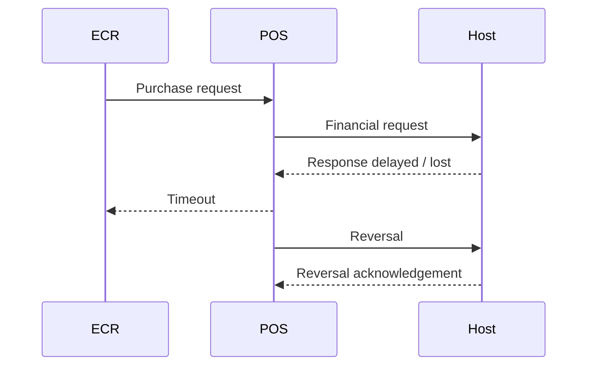

# Transaction Investigation Case Studies

These scenarios are **synthetic QA examples** designed to demonstrate how payment incidents can be investigated across POS, ECR, ISO 8583, EMV, host response, reversal and settlement layers.

> **Privacy note:** No real bank, merchant, terminal, cardholder, production log, credential, key or confidential client information is included.

## Case 1 — Host approved, POS displayed failed

### Scenario
A purchase reaches the host and receives an approval, but the final response does not reach the ECR/POS correctly because communication is interrupted.

### What I would validate
- Match transaction identifiers such as STAN/RRN/reference where available.
- Confirm whether the host actually approved the transaction.
- Check whether the POS received and persisted the final response.
- Verify whether a Last Transaction / transaction inquiry mechanism can recover the final state.
- Confirm that the ECR does not automatically retry the purchase and create a duplicate.
- Validate whether a reversal is required and whether it is generated correctly.

### Expected QA outcome
The system should resolve the final transaction state safely without double charging the customer.

---

## Case 2 — Timeout followed by automatic reversal

### Scenario
A purchase request is sent successfully, but the POS does not receive the host response within the configured timeout.

### What I would validate
- Timeout value and retry behaviour.
- Whether the original transaction was processed by the host.
- Reversal message generation and reference matching.
- Duplicate prevention if the cashier retries.
- Final database/TMS status.
- Settlement impact.

### Expected QA outcome
A communication failure must not leave the transaction in an ambiguous state or cause duplicate financial impact.

---

## Case 3 — Chip failure and fallback to swipe

### Scenario
A contact transaction cannot continue through the chip interface and the terminal moves to fallback when permitted by configuration and scheme rules.

### What I would validate
- Chip attempts before fallback.
- Terminal prompt shown to the customer/cashier.
- Whether fallback is permitted for the scenario.
- Correct POS entry mode / interface information in the financial message.
- Online authorization result.
- Receipt and transaction history.

### Negative checks
- Swipe attempted without a valid fallback condition.
- Contactless failure incorrectly triggering magstripe fallback.
- Fallback disabled by terminal/acquirer configuration.

---

## Case 4 — Incorrect PIN / CVM decline

### Scenario
The customer enters an incorrect PIN during a card transaction.

### What I would validate
- Correct CVM selected by the terminal/card.
- PIN entry/cancel behaviour.
- Host or card decline response mapping.
- Clear customer-facing error message without exposing sensitive data.
- No incorrect approval stored in the transaction database.
- Retry behaviour where permitted.

### EMV review examples
Depending on the transaction and available logs, I may inspect tags such as:
- `9F34` — CVM Results
- `95` — Terminal Verification Results
- `9F27` — Cryptogram Information Data
- `9F26` — Application Cryptogram

---

## Case 5 — Settlement totals mismatch

### Scenario
Terminal totals and host/batch totals do not match during reconciliation or settlement.

### What I would validate
- Purchase/refund/void totals by count and amount.
- Reversed versus completed transactions.
- Transactions created around communication failures.
- Batch number and settlement status.
- Whether retries generated duplicate records.
- Host acknowledgement and terminal batch-clear behaviour.

### Expected QA outcome
The batch should only be cleared after a valid settlement result, and discrepancies should be traceable to individual transaction records.

---

## Investigation checklist

When investigating a payment defect, I normally work through the transaction in this order:

1. Reproduce with controlled test data.
2. Capture timestamp, amount, interface and transaction reference.
3. Check POS/ECR request and visible response.
4. Compare ISO 8583 request/response fields where available.
5. Review EMV decision/CVM/cryptogram information for card transactions.
6. Confirm host-side outcome.
7. Check reversal, retry or Last Transaction behaviour.
8. Validate database/TMS transaction state.
9. Check settlement/reconciliation impact.
10. Document expected result, actual result and evidence.

## Important note

Exact ISO 8583 MTIs, data elements, EMV tags, fallback rules, reversal behaviour and settlement flows vary by host, scheme, kernel, acquirer and implementation. These examples demonstrate a **QA investigation approach**, not a specification for a particular production payment system.
